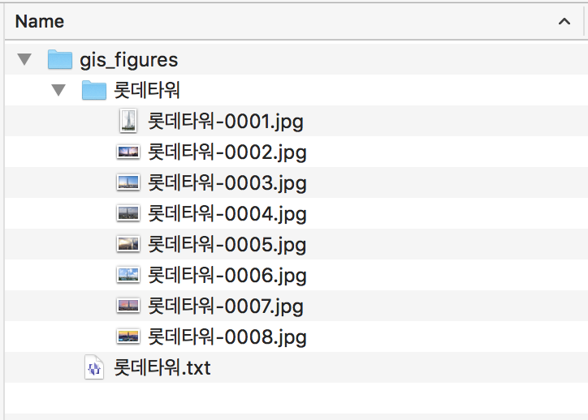

# _**gisd.py (Google Image Searching and Downloading)**_

## <font color=white>_Feature_</font>
<font size=4>Let's <font color=grean><b>_Search_</b></font> and <font color=yellow><b>_Save_</b> </font>google images with <font color=red><b>_keywords_ </b></font>!!</font>

## Description
+ Imaging searching python script using Google Engine
+ The script only supports python3
+ The script is very simple to use and useful for many purpose
+ Outputs of the script are searched images and their original links
+ <font color=yellow>The script automatically skips some images with incorrect link address due to several reasons</font>

### Required modules
+ numpy &nbsp;&nbsp;&nbsp;&nbsp;&nbsp;&nbsp;&nbsp;``` pip install numpy```
+ ssl &nbsp;&nbsp;&nbsp;&nbsp;&nbsp;&nbsp;&nbsp;&nbsp;&nbsp;&nbsp;&nbsp;&nbsp;&nbsp;&nbsp;``` pip install ssl```
+ urllib3 &nbsp;&nbsp;&nbsp;&nbsp;&nbsp;&nbsp;&nbsp;&nbsp;``` pip install urllib3```
+ requests &nbsp;&nbsp;&nbsp;&nbsp;``` pip install requests```

### Usage
+ <b>Run </b>
```
gis.py 롯데타워 8
```
+ <b>Help</b>
```
gis.py --help
```

### Output
* <font size=4>_Searched images in keyword named folder_</font>


* <font size=4>_Links  of the searched images text file_</font>


### Version history
+ Version 0.1: the script release (2020.07.23)


<br>
### <font color=yellow>_Contact for bug reports_</font>
<b>_Uksu, Choi (qtwing@naver.com)_</b>
