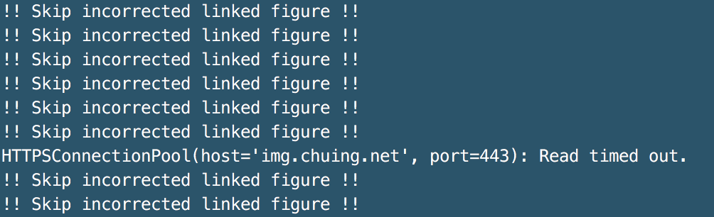

# <font size=6><br>_**gisd.py</br></font> <font size=4>(Google Image Searching and Downloading)**_</font>

## <font color=white>_Feature_</font>
<font size=4>Let's <font color=grean><b>_Search_</b></font> and <font color=yellow><b>_Save_</b> </font>google images with <font color=red><b>_keywords_ </b></font>!!</font>

## Description
+ Imaging searching python script using Google Engine
+ The script is very simple to use and useful for many purpose
+ Outputs of the script are searched images and their original links
+ The script needs <b>_python3_</b>
+ The script supports <b>_Chrome_, _Safari_</b>
+ <font color=yellow>The script automatically skips some images with incorrect link address as below due to several reasons</font>


## Required Modules
+ numpy &nbsp;&nbsp;&nbsp;&nbsp;&nbsp;&nbsp;&nbsp;``` pip install numpy```
+ ssl &nbsp;&nbsp;&nbsp;&nbsp;&nbsp;&nbsp;&nbsp;&nbsp;&nbsp;&nbsp;&nbsp;&nbsp;&nbsp;&nbsp;``` pip install ssl```
+ urllib3 &nbsp;&nbsp;&nbsp;&nbsp;&nbsp;&nbsp;&nbsp;&nbsp;``` pip install urllib3```
+ requests &nbsp;&nbsp;&nbsp;&nbsp;``` pip install requests```

## Usage
+ <b>Run in Terminal</b>
```
gisd.py 롯데타워_편의점_지하철 8
gisd.py 롯데타워 8
```
+ <b>Help</b>
```
gisd.py --help
```

## Tip
+ If you want to search multiple keywords, use '_' between keywords

## Outputs
* <font size=4>_Searched images in keyword named folder_</font>


* <font size=4>_Links  of the searched images_</font>


## Version history
+ Version 0.1: the script release (2020.07.23)

## _Contact for bug reports_
_Uksu, Choi (qtwing@naver.com)_
